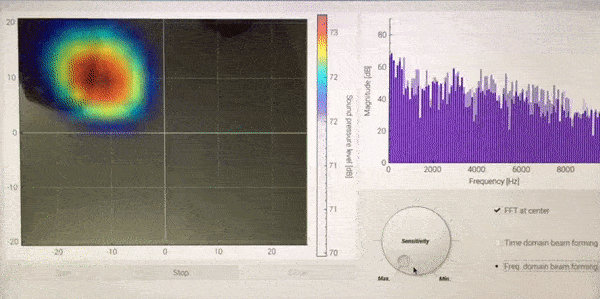
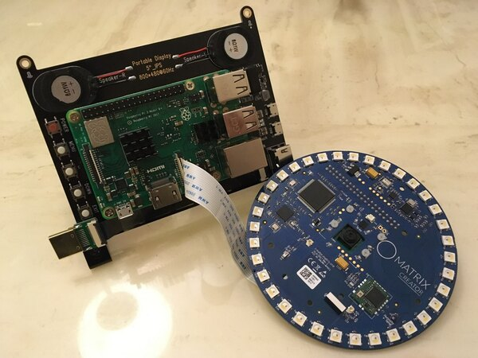
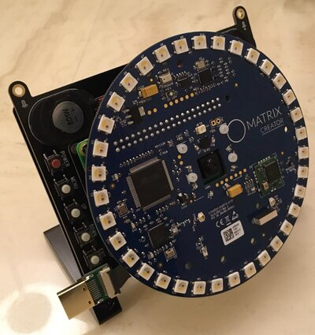
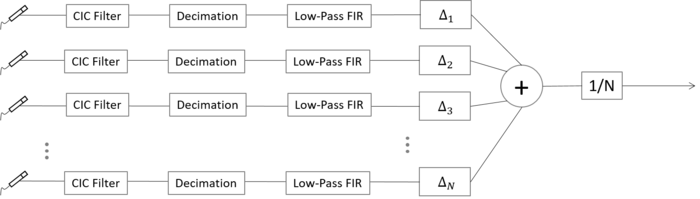
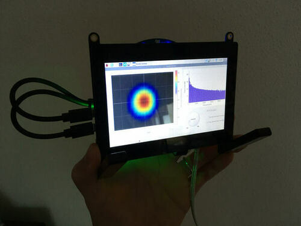
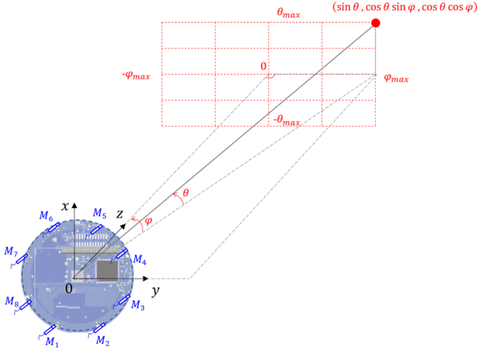
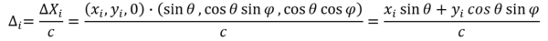
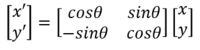
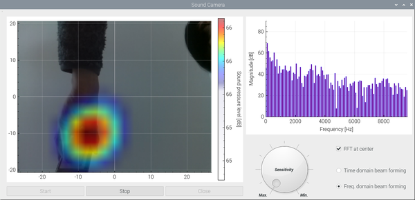

# Acoustic Camera with Raspberry pi and Matrix Creator
The **delay-and-sum beamforming in the time/freqeuncy domain** is implemented with Raspberry pi 3b+ and the digital 8 MEMS microphones on the [MATRIX Creator](https://matrix-io.github.io/matrix-documentation/matrix-creator/overview/). 


</br><Demonstration of Sound camera, while moving iPhone (playing music) over the microphone array></br>´


## System Overview
The whole system consists of the three parts, i.e. ***5 inch touch-screen***, ***Raspberry pi with V1 Camera***, and ***MATRIX creator***. 



</br><Raspberry 3b+ with Camera + 5 inch touch-screen, before connecting Matrix Creator over RPi GPIO></br>


</br><The assembled acoustic camera></br>

</br>
The core part of signal measurement and post-processing (e.g. CIC filter, Decimation, and FIR filter) is done in the FPGA code of MATRIX creator and the detailed explanation of FPGA code can be found [here](https://github.com/Hoi-Jeon/Verilog-for-Mic-in-Matrix-Creator).



</br><The schematic of the delay-and-sum beamformign in the time domain ></br>

- Sampling frequency: 48 kHz (Adjustable in Matrix creator HAL codes)
- Number of samples per one microphone: 512 (Adjustable in Matrix creator HAL codes)
- Number of points in the azimuthal angle: 21 (Adjustable in C++ codes)
- Number of points in the polar angle: 16 (Adjustable in C++ codes)


**WARNING**: Strangely speaking, **Matrix HAL** C++ codes do not work well, when the **matrixio-kernel-modules** is installed. This problem should be investigated further in future. For the time being, one can use the following command to remove **matrixio-kernel-modules** from RPi.

```
sudo apt remove matrixio-kernel-modules
```


</br> <Acoustic Camera operation with 5" touch-screen> </br> 


## Theory
A delay-and-sum beamforming is the signal processing technique for detecting a direction of incoming acoustic waves by using the phase differences between multiple microphones in an array. </br>

In this hobby project, a microphone array on the market with 8 Digital MEMS microphones is used. Thus, a number of microphones and their locations in the microphone-array are already fixed. The core of the delay-and-sum beamforming technique is to calculate the time delay at one microphone to the reference point of delay (i.e. normally the center of microphone array) as shown below: </br>.


</br> <Time delay calculation with 8 PDM microphones in the spherical coordinate >

The time delay at the *i*th microphone to a given direction can be calculated in the spherical coordinate as follows:


</br><The time delay at the ith microphone with respect to one point in the sound field grid>

Even though MATRIX manufacturer provides the coordinates of microphones in the [official websites](https://matrix-io.github.io/matrix-documentation/matrix-creator/resources/microphone/), the origianl x-y coordinate of microphone array is rotated by 90° degree clockwise in this project, for a convenient formulation of time-delay equation in the spherical coordinates. The rotation of the coordinate can be simply done by using the following matrix equation and its values are defined as the static const double 2D array in the c++ codes: </br>


</br> <An equation for rotating the x-y coordinate by 90 degree >

```c++
// The new coordinates for the 8 microphones with the 90° clockwise rotated x-y coordinate

static const double_t MIC_coordinates[][2] = {
	{-48.5036755, -20.0908795},  
	{-48.5036755,  20.0908795},
	{-20.0908795,  48.5036755},
	{ 20.0908795,  48.5036755},
	{ 48.5036755,  20.0908795},
	{ 48.5036755, -20.0908795},
	{ 20.0908795, -48.5036755},
	{-20.0908795, -48.5036755}};
```

The way of summing up the delayed microphone signal at each microphone is quite straightforward, but one should be careful with the **quantization Error** during the summation. This error occurs, due to the fact that the calculated time delay are NOT always an integer number of sampling time resolution. There are several elegant ways to reduce the error (e.g. upsampling, interpolation), but the current version of code takes the simplest way, so called **Nearest-neighbor interpolation**. This should be improved in future, for a better beamforming performance. On the other hand, one should keep his eyes on the available computation resource when implementing more elegant and complex methods. The details of the current "Nearest-neightbor interpolation" is explained in the c++ codes, **SoundCamera::BeamFormingTime**:

```c++
/*
 * double_t SoundCamera::BeamFormingTime(int16_t Nr_Azimuthal, int16_t Nr_Polar)
 * - Do the delay-and-sum beamforming in the time domain wihout upsampling and interpolation
 *   
 * <Algorithm explanation>
 * 1st mic [index = -3]: [M1[0], M1[2], M1[3], M1[4], M1[5], M1[6], ...]
 * 2nd mic [index = -1]: [    -,     -, M2[0], M2[1], M2[3], M2[4], ...]
 * 3rd mic [index = +1]: [    -,     -,     -,     -, M3[0], M3[1], ...]
 * 4th mic [index = +0]: [    -,     -,     -, M4[0], M4[1], M4[2], ...]
 * 
 * Beamformed data sum : [    x,     x,     x,     x, M1[5]  M1[6]  ...
 *                                                   +M2[3] +M2[4]  ...
 *                                                   +M3[0] +M3[1]  ...
 *                                                   +M4[1],+M4[2], ...]
 * 
 */

double_t SoundCamera::BeamFormingTime(int16_t Nr_Azimuthal, int16_t Nr_Polar) 
```

In addtion, the frequency-domain is also implemented in this code and its detailed technical explanation can be found in the following link [here](https://www.acoustic-camera.com/en/services/noise-and-vibration-blog/delay-and-sum-beamforming-in-the-frequency-domain.html).


## Graphical User Interface (GUI)
### Qt creator
[Qt creator](https://www.qt.io/product/development-tools) is used for GUI. For its installation, one can use the following commands: </br>

```
sudo apt-get install qt5-default
sudo apt-get install qtcreator
```

</br> <GUI of acoustic camera> </br> 

The colormap of acoustic camera and FFT bar-graph at the center position are displayed on the left and right side, respectively. With the three buttons below, one can start, stop, and close GUI. The sensitivity of acoustic camera can be controlled by the dial. Two different types of beamforming algorithm can be selected by two radio buttons on the right bottom. 

### FFTW
[FFTW library](https://wiki.qt.io/How_to_use_FFTW) was used for a fast FFT calculation in the GUI. FFTW is installed automatically, when one installs all necessary MATRIX creator drivers. </br>

### Qcustomplot
[QCustomplot (GPL V3 license)](https://www.qcustomplot.com/index.php/introduction) is a Qt C++ widget for plotting and data visualization. The semi-transparent colormap and FFT plot were created by using this powerful graphic widget in Qt. </br>

### RaspiCam
[RaspiCam (BSD license)](https://www.uco.es/investiga/grupos/ava/node/40) is C++ API for using Raspberry camera with/without OpenCv. It is very easy to [download](https://sourceforge.net/projects/raspicam/files/?), install and use. One small issue was that this API with **OpenCV Interface** didn't work in Qt at my RPi , but fortunately **OpenCV** was not necessary for this hobby project.
</br>

### Raspberry pi Camera module V1
[RPi Camera module V1](https://www.raspberrypi.org/documentation/hardware/camera/) was used for a camera. Its Horizontal field and Vertial of view are ***53.50 +/- 0.13 degrees*** and ***41.41 +/- 0.11 degrees***, respectively.
</br>

## Open points
- Improvement of quantization error in the time-domain beamforming
- Consideration of microphone directivity

## Remarks
Some parts of C++ codes are got from internet search and I always tried to copy the codes **with reference** and **without violating any copyright**. Nevertheless, please let me know if there is any possible copyright infringement issue in the codes. Then, I will remove it from the repository immediately.
